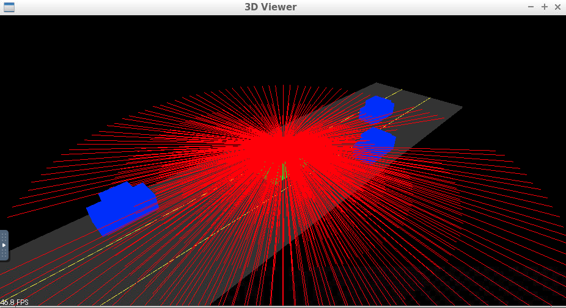
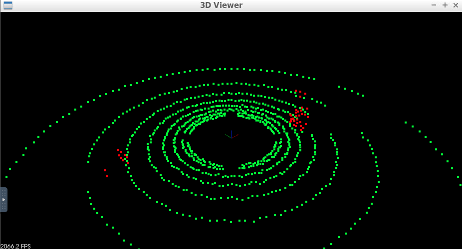
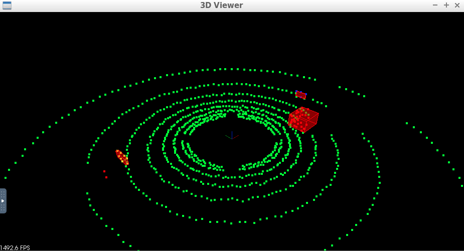

# LIDAR Obstacle Detection
This is a project of Udacity [Sensor Fusion](https://www.udacity.com/course/sensor-fusion-engineer-nanodegree--nd313) Nanodegree.
The starter code of this project was downloaded from Udacity's official [github repositry](https://github.com/udacity/SFND_Lidar_Obstacle_Detection). 

If you are facing trouble in running the code, I suggest you to refer [this](https://github.com/udacity/SFND_Lidar_Obstacle_Detection/blob/master/README.md) first for installation of all the dependencies.

---
## Step by step implementation of the project
1. Created an enviornment to visualize the LIDAR working principle.

2. Visualized point cloud data generated

3. Planer Segmentation using RANSAC

4. Voxel Filtering and implemented Clustering and bounding box on the obstacles

5. Streaming the point cloud files and then applying to all the frames as detected.

